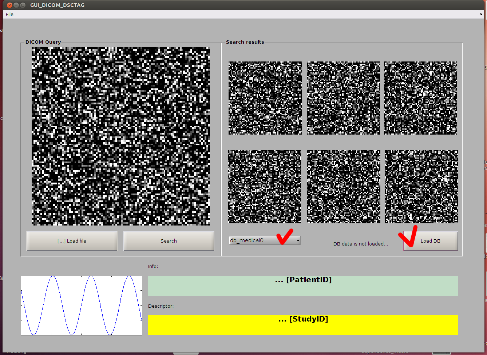
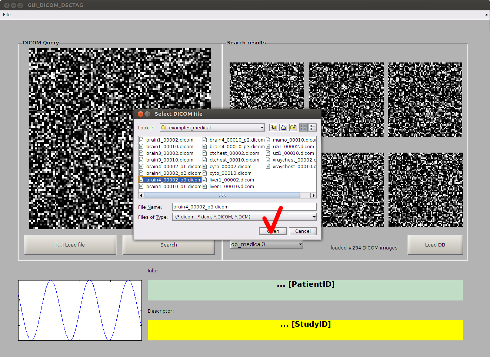
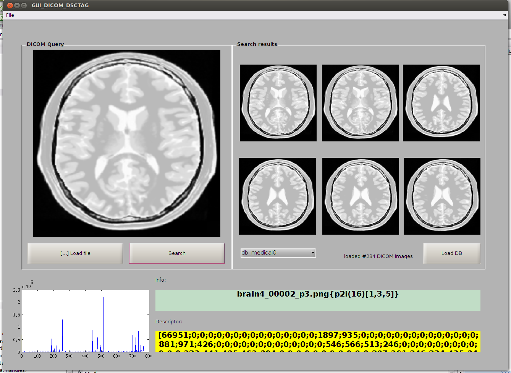

# DICOM_DescriptorTag_Matlab

Demonstration program.
Image Descriptor is saved as a DICOM-tag and
is used to solve CBIR (Content Based Image Retrieval)
task.

==========================
(1) Load database:

(2) Select query DICOM image

(3) Run search:

